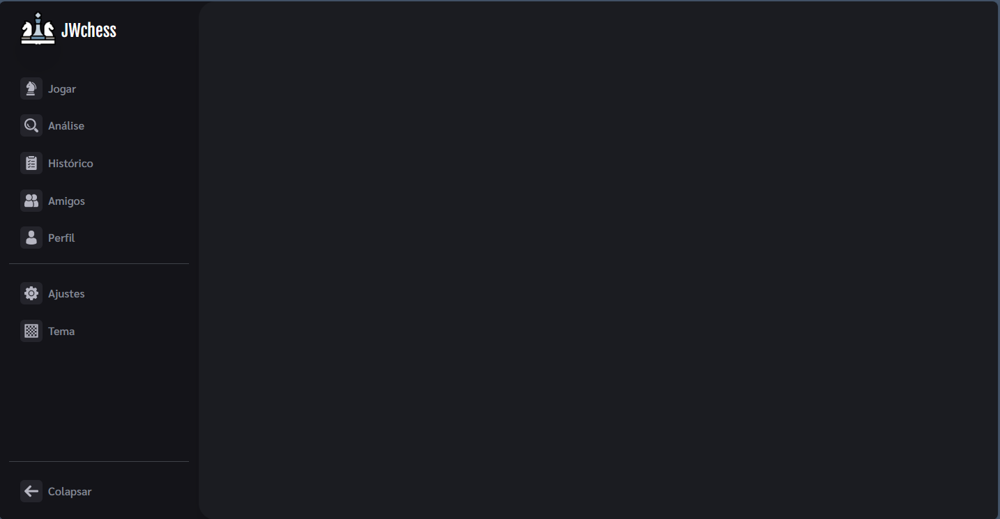

# Chess Game

Chess Game é um começo de um projeto que está sendo desenvolvido, será uma plataforma para jogar Xadrez, tanto offline quando online e a onde também será possível análisar suas partidades usando engine, o projeto ainda está no começo porém o progresso está bem encaminhado.

[EN] Chess Game is the beginning of a project that is being developed, it will be a platform to play Chess, both offline and online and where it will also be possible to analyze your games using an engine, the project is still in its infancy but progress is well underway.

## Como rodar o projeto

https://chess-game-ashy.vercel.app/

Linha de comando:

1. Faça download do projeto
2. abra o cmd dentro da raíz do projeto
3. Instale as dependências com `npm install`
4. rode o projeto com `npm run dev`
5. Aprecie 🚀

## Home

## Feedback

Se você tiver algum feedback, por favor me informe para eu evoluir meus conhecimentos.

[EN] If you have any feedback, please let me know so I can improve my knowledge.

## Contribuindo

Contribuições são sempre bem-vindas!

[EN] Contributions are always welcome!

